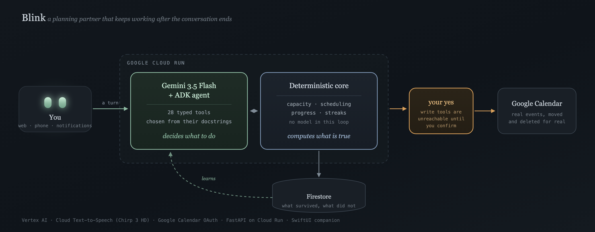

# Blink

**A calm, long-horizon planning agent that turns loose goals into a real schedule — and looks back at you while it does it.**

Blink is an ambient presence, not a chat box. You tell it something as vague as *"I want to become a data scientist,"* and instead of shrugging or hallucinating a generic plan, it gets **curious**: it asks what learning platforms you already have, your level, your weekly hours, your timeline — one calm question at a time — then synthesizes a concrete, sequenced, time-blocked plan around your real availability. Say *"my meeting ran over"* and it quietly rebalances your week, tells you exactly what moved, and shows you the diff.

🟢 **Live:** https://blink.oapps.dev
🎥 Demo video: _(link at submission)_
🏷️ Built for the **All Things Agentic Hackathon** — Collaborative Partner track.

---

## Claims → where they are proven

Every row is a claim we make, the file that proves it, and a way to check it in seconds.
Nothing here rests on a document's own word.

| Claim | Where it is proven | How to verify |
|---|---|---|
| A real Google ADK agent is on the live request path, not decoration | `root_agent` in `src/agent/agent.py:210`; `run_chat_turn` in `src/agent/agent_runtime.py:398`, called from `src/api/server.py:1507`, `:1570`, `:1594`, `:1612` | `grep -n run_chat_turn src/api/server.py` |
| 28 typed, docstring'd, status-returning tools over a pure deterministic core | `ALL_TOOLS`, `src/agent/tools.py:3093` | `python -c "from src.agent.tools import ALL_TOOLS; print(len(ALL_TOOLS))"` → `28` |
| Google Calendar writes are gated **structurally**, not by prompting | The four `*_confirmed` wire tools are removed from the model's toolset (`src/agent/tools.py:3093`); `before_tool_callback=_block_unconfirmed_writes` is the belt (`src/agent/agent.py:222`) | `python -c "from src.agent.tools import ALL_TOOLS; print([t.__name__ for t in ALL_TOOLS if t.__name__.endswith('_confirmed')])"` → `[]` |
| Committed focus blocks are mirrored into real Google Calendar, best-effort, and the reply is composed from what actually landed | `src/api/calendar_mirror.py` (`MirrorResult`; never raises into the commit path, idempotent, retryable) | `python -m pytest -q tests/unit/test_calendar_mirror.py` |
| Timer-measured minutes and self-reported minutes are kept apart and never summed | `get_progress`, `src/agent/tools.py:1045` (see the `NEVER SUMMED` comment at `:1156`) | `grep -n "NEVER SUMMED" src/agent/tools.py` |
| Insights are mined deterministically, never on fewer than three occurrences, and change nothing without your consent | `src/core/insights.py`; surfaced one at a time by `_strongest_insight_payload`, `src/api/server.py:2068` | `python -m pytest -q tests/unit/test_insights.py` |
| Reply text is post-checked against the real outcome; a rephrase that drops a real count is discarded | `src/agent/conversation.py` + the grounded-reply invariants | `python -m pytest -q tests/unit/test_grounded_responses.py tests/unit/test_reply_evidence.py` |
| We audited our own agent against 100 realistic requests, fixed the gaps, and re-scored | `docs/AGENT_COVERAGE_AUDIT.md` (effective pass rate 42/100 → 54/100, with every remaining miss still listed) | read §(b) and §(c) |
| Tool **selection** is measured against the live model, and a destructive mistake is scored separately | `tests/evalsets/tool_selection_probe.py` (exit code 2 is reserved for a delete/cancel that fired where it was not authorised) | `tests/evalsets/TOOL_SELECTION_PROBE.md` |
| Blink is measured against Google's own agent canon, PARTIAL and ABSENT verdicts included | `docs/AGENTIC_STANDARDS_AUDIT.md` | read it |
| 987 tests, fully offline: the LLM mocked at one seam, Firestore off | `tests/` | `python -m pytest -q` |
| The app boots and serves a turn with **no credentials at all** | deterministic fallbacks on every LLM path; `/_health` reports `"backend": "memory"` | see [Run it locally](#run-it-locally) |

## The problem

Knowledge workers burn cognitive effort on three things that aren't the work itself: **decomposing** big opaque goals, **arbitrating** what to do right now, and **maintaining** the plan after reality diverges from it. Task managers store tasks you already decomposed; calendars store blocks you already decided on; chatbots forget you between sessions. The gap is a partner that carries state, exercises judgment, and **keeps working after the conversation ends**.

## The data loop

Blink is a data partner, not a chatbot that remembers.

**Ingests.** Every channel you give it: typed and spoken messages (browser speech
recognition into the same turn endpoint), syllabus and timetable photos through Gemini
vision (`POST /ingest-image`), your Google Calendar over OAuth, a get-to-know-you
interview on first run, and a focus timer that *measures* work instead of trusting a
self-report.

**Lifecycle.** Hard rules, not vibes. Timer minutes are recorded fact and a later
self-report can never overwrite a measurement (`actual_source: "timer"`). The
conversation log is capped at 40 entries so the prompt window cannot grow unbounded
(`CONVERSATION_MAX_ENTRIES`, `src/sim/fake_store.py:14`), which is the concrete answer to
context rot. Live listeners and the trace stream are never persisted. Only the workspace
sections that actually changed are written back to Firestore, after the response, off the
request path (`src/agent/persistence.py`). Progress, streaks and pacing are derived at
read time so no stored number can drift.

**Filters.** Insight mining refuses to fire on fewer than three occurrences, and an
insight you accepted or dismissed never comes back (`src/core/insights.py`,
`src/api/server.py:2068`). At most one insight rides any single response, chosen by
evidence count. `web_search` asks before its first search and hands the model URL-free,
scrubbed source cards, so it cannot recite a URL it never saw (`_speakable_sources`,
`src/agent/tools.py:561`). Grounded page text is treated as untrusted data, never as
instruction.

**Shapes the response.** Durable facts change what Blink says and does, not just what it
can recall: no-touch zones from onboarding constrain the capacity arithmetic and are cited
back to you ("I kept your Work and Sleep time clear"); `get_progress` is the only grounding
for "how am I doing", and it quotes measured and reported minutes as two separate numbers
because summing them would be a lie.

**Self-improves.** Accept an insight and it graduates into durable state: a learned
no-touch zone the capacity math then respects, or a planning key point that joins the
synthesis prompt for every future plan (`src/agent/specialists/onboarding.py:286-325`,
`src/agent/specialists/plan_synthesizer.py:232`). Decline it and the id is recorded as
dismissed, so it is never offered again. Memory here is not recall, it is behaviour
change: filtered to what the evidence supports, and gated on your consent.

## What makes it different

- **It fishes for context instead of dumping a form.** A vague goal triggers a guided elicitation loop (platforms → level → hours → timeline), then a real plan: a vague sentence becomes a paced multi-week schedule in under two minutes. A concrete brain-dump ("Write intro, 60m. Edit draft, 30m.") schedules straight away.
- **The model judges, the code computes.** Gemini routes intent, turns messy input into typed structure, and phrases every reply; a pure, tested, deterministic core owns every number (capacity, scheduling, priority). **Zero hallucinated time slots** — the model calls a scheduling tool and reports what actually got placed, with the real counts post-checked into every reply.
- **It never claims what it didn't do.** Reply text is derived from the real outcome: "I broke that into 4 tasks and scheduled 4 sessions" only when it did; an honest "couldn't place them yet" with the scheduler's actual reason when it didn't.
- **"Life happens" is a first-class input.** "I'm sick today" / "my meeting ran over" triggers an autonomous rebalance: today clears, sessions re-place into open room, the week view animates the diff (ghosts fade at the old slots, moved blocks spring in), and the spoken summary carries the exact counts. Venting ("I'm tired") gets empathy, not a replan.
- **An interface that feels like a presence.** The home screen is two glowing capsule eyes that blink on human timing, track your cursor, and speak twelve emotions (curious while asking, worried when something didn't fit, a heart when your first plan lands). The plan lives one gesture behind them: the eyes morph aside and a zoomable horizon opens — day → week → month → quarter → year, with a pacing sentence computed from your real hours ("You need 6h a week. You're averaging 4. That lands Jan 6 — a touch behind."). Replies speak in a calm Chirp3-HD voice with caption-style word sync.
- **It learns your life before it plans it.** First run opens with a short get-to-know-you interview; work hours, sleep, standing commitments become no-touch zones in Blink's own memory (never calendar clutter) that the capacity math respects — and replies cite it: *"I kept your Work and Sleep time clear."* Say "remember I hit the gym at 6pm on Tuesdays" any time and it asks to confirm, then plans around it.
- **Measured work, not claimed work.** A focus session binds a timer to the current block: elapsed minutes are recorded fact, a timer measurement can't be overwritten by a later self-report, idle gaps pause and ask instead of silently counting, and the evening check-in confirms recorded reality instead of quizzing your memory.
- **It adapts — with your consent.** Deterministic pattern mining over your measured history (never fewer than three occurrences) surfaces at most one insight at natural moments: *"4 of your last 5 Monday evening sessions fell through. Want me to stop planning Monday evenings?"* Accept and it graduates into memory; decline and it never nags about that pattern again.
- **Real calendar, guarded writes.** Google Calendar OAuth (read + write); every write is a human-in-the-loop tool confirmation: `propose_create_event` never touches Google, and only your explicit yes routes to `create_event_confirmed` (`src/agent/tools.py`). A governed external action, in the pattern catalog's terms. A missing Calendar scope is detected and recoverable in-app.
- **It degrades, never fabricates.** Every LLM path has a deterministic fallback, so the app keeps working even if Gemini is unavailable — it just says so.

## Hackathon requirements → how we meet them

| Requirement | Implementation |
|---|---|
| **Gemini 3.5 or newer** | `gemini-3.5-flash` (judgment + vision) and `gemini-3.5-flash-lite` (per-turn intent routing) via **Vertex AI** (`src/agent/llm.py`) |
| **A Google agent framework** | **Google ADK** (`root_agent` + typed tools in `src/agent/`) and the **GenAI SDK** for structured output |
| **A Google Cloud service** | **Cloud Run** (deployed) + **Vertex AI** + **Firestore** (durable workspace state) + **Cloud TTS** (Chirp3-HD voice) + **Secret Manager** (OAuth secret) |
| Backend on Google Cloud | Live Cloud Run service, keyless Vertex via the runtime service account |

## Architecture



See **[`docs/DIAGRAMS.md`](docs/DIAGRAMS.md)** for the full set (system topology,
the loose-goal flow, the division of labour, and the truthfulness contract —
mermaid, renders inline on GitHub). Structurally, Blink is the agent triad from
Google's Agents whitepaper made concrete: a **model** (Gemini 3.5 Flash behind
one gateway, `src/agent/llm.py`), **tools** (typed, docstring'd,
status-returning functions over a pure deterministic core, `src/agent/tools.py`),
and an **orchestration layer** (the turn router plus the LLM specialists,
`src/api/server.py` and `src/agent/specialists/`). In short:

- **Browser** — the eyes presence + horizon + response-component kit (`src/web/`, nine ownership-scoped stylesheets, vanilla component factories).
- **FastAPI** (`src/api/server.py`) — a **turn router** (`/turn`) classifies every message (chat · plan a goal · concrete tasks · disruption) and routes it; `/elicit/answer` runs the elicitation loop; `/details` powers the horizon; `/calendar/*` handles OAuth + sync; `/tts` speaks.
- **LLM specialists** (`src/agent/specialists/`) — `intent_router`, `goal_classifier`, `elicitor`, `extractor`, `plan_synthesizer`, all LLM-first with deterministic fallbacks, all through one Gemini gateway (`src/agent/llm.py`) with client-lifecycle hygiene (timeouts, stale-client rebuild, retry-once).
- **Deterministic core** (`src/core/`) — pure capacity ledger, greedy scheduler, rebalancer, validator, priority scoring, milestone progress accrual. Zero I/O, fully tested.
- **State** (`src/agent/workspace_registry.py`, `persistence.py`) — Blink keeps **session state** and **long-term memory** separate, the same split ADK draws between a Session and a MemoryService: the conversation thread (`src/agent/conversation.py`) is per-session working context, while a typed `Memory` entity (`src/types/entities.py`) holds durable cross-session facts (no-touch zones from onboarding, accepted insights) inside the persisted `meta` section. The working copy is in memory for speed; **Firestore** (native mode, database `blink`) holds a snapshot per workspace, split into six documents (`commitments`, `tasks`, `blocks`, `zones`, `constraints`, `meta`). A workspace hydrates from Firestore the first time a fresh instance touches it (that hydration is the recovery path for Cloud Run scale-to-zero and instance death), and only the sections that actually changed are written back, after the response, off the request path. Live asyncio listeners and the trace stream are never persisted. If Firestore is unavailable, Blink logs one line, keeps serving from memory, and `/_health` reports `"backend": "memory"` so nothing ever claims state was saved when it was not. (The route is `/_health`, not `/healthz`: Google's frontend reserves `/healthz` and returns its own 404 before the request reaches Cloud Run.)
- **ADK agent + tools** (`src/agent/agent.py`, `tools.py`) — the deterministic core exposed to the model as docstring'd, typed, `status`-returning tools.

## Implementation insights

Five decisions that carry the codebase:

1. **The model judges, the code computes.** Gemini owns everything fuzzy (intent, extraction, phrasing); a pure zero-I/O core owns every number. A reply's counts are post-checked against the real outcome, and a rephrase that drops a real count is discarded for the honest template.
2. **The finish-reason guard.** Gemini 3's thinking tokens count against `max_output_tokens`, so a tight cap silently truncates replies mid-sentence. Any non-STOP finish degrades to the honest template instead of shipping a fragment.
3. **Measured beats claimed.** Timer minutes are recorded fact (`actual_source: "timer"`); a later self-report can never overwrite a measurement, and every downstream judgment (pacing, insights, replans) runs on evidence.
4. **Snapshot persistence, dirty-tracked.** The workspace serializes into six Firestore documents; only the sections that actually changed are written back, after the response, off the request path. If Firestore is down, Blink serves from memory and says so.
5. **Emotions must be true.** The face's twelve emotions (plus the thinking state) ride composed CSS variable channels and only fire when the grounded data backs them: `worried` requires a real unplaced count, `heart` requires a first plan that actually placed blocks.

## More than fits in four minutes

Things we are proud of that a four-minute video cannot hold:

- A twelve-emotion vocabulary plus a thinking state, riding composed `--emo-*` variable channels so a blink always layers cleanly on top of any expression, on all three faces.
- The streaming word-reveal sync math: the reveal deliberately over-estimates duration mid-stream so words can lag the voice but never lead it, snapping exact on the last chunk.
- The emotion truthfulness rule: every expression is wired to a grounded trigger, and every one is rehearsable from the console via `window.__emote(name, holdMs)`.
- An iOS companion in `companion/` that shares the same brain through the same API: the same eyes, the same honesty, in your pocket.
- A localised day boundary: "today" is the user's day, not UTC's, published by one server clock that every consumer reads.

## Run it locally

**Prereqs:** Python 3.13 (3.11+ may work; 3.13 is what the suite runs on), and (for the live Gemini path) a Google Cloud project with **Vertex AI enabled** and credentials — either a service-account key or `gcloud auth application-default login`. Without credentials the app still runs on its deterministic fallbacks.

```bash
# 1. clone + enter
git clone https://github.com/cozyCodr/blink.git
cd blink

# 2. virtualenv + deps
python -m venv .venv && source .venv/bin/activate
pip install -r requirements.txt

# 3. configure — OPTIONAL (copy .env.example -> .env and fill in)
#    Simplest local path: set GEMINI_API_KEY (already stubbed in .env.example).
#    For keyless Vertex instead, add these to .env:
#      GOOGLE_GENAI_USE_VERTEXAI=TRUE
#      GOOGLE_CLOUD_PROJECT=<your-project>
#      GOOGLE_CLOUD_LOCATION=global
#      GOOGLE_APPLICATION_CREDENTIALS=</abs/path/to/sa-key.json>   # or use ADC
cp .env.example .env   # then edit

# 4. run (either one). The app reads the environment, not the file, so export it first;
#    skip the export entirely and Blink still runs on its deterministic core.
set -a && source .env && set +a
uvicorn src.api.server:app --host 0.0.0.0 --port 8080

# or containerised, exactly the way Cloud Run runs it:
docker build -t blink . && docker run --env-file .env -p 8080:8080 blink
```

**No credentials needed to run it.** With an empty environment the app still boots and
serves a real turn: `GET /_health` returns `200` with `"backend": "memory"`, and every
LLM path answers from its deterministic fallback (`POST /v1/workspaces/{id}/turn` replies
with the real state of the workspace and says it is running without the model). Verified
from a clean environment. Credentials only add the Gemini, Firestore, Calendar and TTS
paths.

Open **http://localhost:8080**. Tap the mic, type *"I want to become a data scientist,"* and answer the questions.

## Tests

```bash
source .venv/bin/activate
python -m pytest -q     # 987 passing, fully offline (the LLM is mocked, Firestore is off)
```

There is also an ADK-native evalset that runs the real `root_agent` in Google's own harness — strict tool-trajectory scoring plus final-response matching (see `tests/evalsets/README.md`; unlike pytest it drives the live Gemini model, so it needs the Vertex credentials from `.env`):

```bash
pip install "google-adk[eval]"   # one-time
PYTHONPATH=. .venv/bin/adk eval src/agent tests/evalsets/blink.evalset.json \
  --config_file_path tests/evalsets/test_config.json --print_detailed_results
```

The suite covers both halves of agent evaluation: **trajectory** (scenario tests in `tests/scenarios/` drive full pipelines end to end and assert the route and tool path taken) and **final response** (the grounded-reply invariants assert the text matches what actually happened, `tests/unit/test_grounded_responses.py`). The deterministic core, every specialist's fallback, and the disruption pipeline are all covered too. 987 tests, fully offline, with the LLM mocked at the `llm.set_client` seam, so the whole suite runs without spending a single token.

## Deploy to Cloud Run

```bash
gcloud auth login                       # an account that owns the project
bash deployment/deploy.sh               # builds via Cloud Build, deploys keyless-Vertex
```

State persistence needs the Firestore database once per project:

```bash
gcloud firestore databases create --database=blink --location=nam5 \
  --type=firestore-native --project focus-agent-506601
```

`deployment/deploy.sh` grants the runtime service account `roles/datastore.user`,
sets `BLINK_FIRESTORE=1` and `FIRESTORE_DATABASE=blink`, enables the needed APIs, builds from the `Dockerfile` in Cloud Build, and deploys with the runtime service account providing keyless Vertex access and the OAuth client secret mounted from Secret Manager. `.gcloudignore` keeps secrets and local env out of the upload.

## Tech stack

Python 3.13 · FastAPI · Pydantic v2 · Google ADK · Google GenAI SDK · **Gemini 3.5 Flash (Vertex AI)** · **Firestore** · **Cloud TTS Chirp3-HD** · GSAP (Flip + SplitText) · Tailwind layout utilities · **Cloud Run**.

## Where this goes next

Blink today is the planner that keeps working after the conversation ends. The
direction is a planner that **starts doing**:

- **Timed actions.** "Send that email at 4pm" — scheduled, confirm-gated
  actions through Google's APIs, the same way calendar writes are gated today.
- **A desktop companion with computer use.** Blink on your desk, able to open
  the doc, start the meeting, file the thing — executing steps of the plan it
  made, under the same never-act-without-consent rules.
- **A pocket companion.** A minimal mobile presence whose only jobs are
  encouragement and reminders — the Duolingo half of accountability. The iOS
  app in `companion/` is this, in progress, sharing the same brain through the
  same API.
- **Agent ops.** Today every turn already logs one legible decision line
  (intent, counts, latency) and persistence logs its dirty sections
  (`src/agent/decision_log.py`); next are OpenTelemetry trace export under the
  GenAI semantic conventions and recasting the specialists as ADK `sub_agents`
  (an `adk eval` evalset already ships in `tests/evalsets/`).

## Repository map

One line per folder, so you can find things fast:

```
src/agent/          # LLM gateway (llm.py), ADK root_agent + typed tools, the specialists/,
                    #   voice + TTS, conversation thread, persistence.py (Firestore snapshots)
src/core/           # the pure deterministic engine: capacity ledger, scheduler, rebalancer,
                    #   validator, priority scoring, progress/streak/pacing (zero I/O, fully tested)
src/api/            # FastAPI server: turn router, elicitation loop, horizon details,
                    #   calendar OAuth + sync, TTS streaming
src/web/            # the eyes presence + horizon UI: app.js component factories,
                    #   css/ split into nine ownership-scoped stylesheets
src/types/          # the Pydantic domain model (entities.py)
src/memory/         # the memory manager over the durable Memory entity
src/sim/            # offline simulation: fake store, personas, scenario runner
companion/          # the iOS companion (SwiftUI): same brain, same API, in your pocket
tests/              # 987 offline tests (unit + scenario; the LLM is mocked, Firestore off)
tests/evalsets/     # the adk eval evalset + the live tool-selection probe (billable, never in CI)
docs/               # PRD, ARCHITECTURE, DIAGRAMS, the companion design docs, and two
                    #   audits: AGENT_COVERAGE_AUDIT (100 scenarios scored against real
                    #   code) and AGENTIC_STANDARDS_AUDIT (Blink vs Google's agent canon)
deployment/         # deploy.sh (Cloud Build only), seed_demo.sh, cloud_run.yaml
.agents/rules/      # the engineering rulebook the code is held to (start with agent-governance.md)
```

`.agents/rules/` is the rulebook the code is held to, and it is worth reading
before the code: `agent-governance.md` carries the invariants ("the model
judges, the code computes", zero hallucinated datetimes, degrade rather than
fabricate), and `frontend-standards.md` carries the CSS ownership split, the
`data-face` theme scope, and the twelve-emotion vocabulary.

## License

[PolyForm Noncommercial License 1.0.0](LICENSE). Free to use, study, modify and
share for any noncommercial purpose, including personal projects, study and
research. Commercial use is not granted by this license; get in touch if you
want one.
