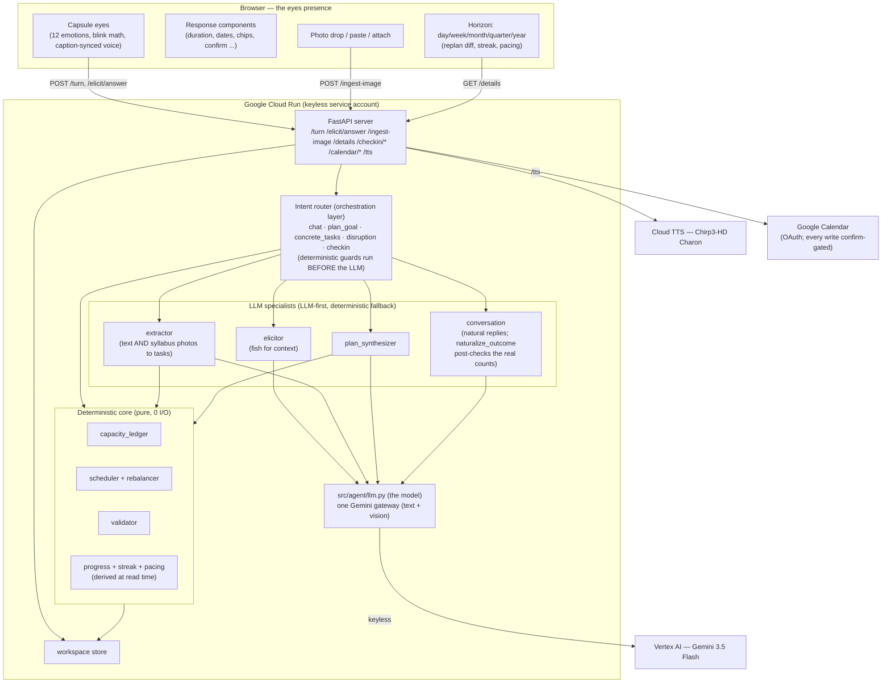
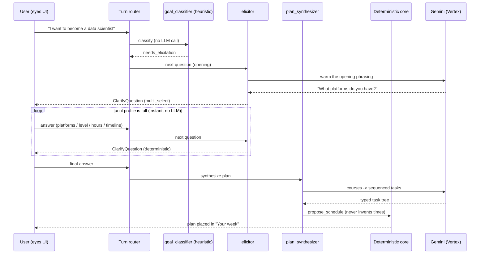
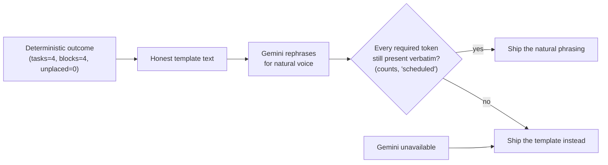

# Blink — System Diagrams

Companion to `README.md` and `ARCHITECTURE.md`. The governing principle is
**"the model judges, the code computes"**: Gemini turns messy human input into
typed structure and exercises judgment; a pure, deterministic core owns all the
arithmetic (capacity, scheduling, priority) so times are never hallucinated.

---

## 1. System topology (deployed)

**Why it is decoupled this way:** every specialist is LLM-first with a
deterministic fallback, so the app degrades instead of dying if Gemini is
unavailable. The core never calls the model; the model reaches the core only
through typed, docstring'd, status-returning tools (`src/agent/tools.py`).
State lives behind one store interface. In the Agents whitepaper's triad, the
gateway is the model, `tools.py` is the tools, and the router plus specialists
are the orchestration layer.

---

## 2. The signature flow — a loose goal becomes a plan

---

## 3. Division of labour

| Concern | Owner | Why |
|---|---|---|
| Classify / decompose / synthesize | Gemini | Unstructured to structured |
| Which question to ask, how to phrase it | Gemini + rules | Judgment + human voice |
| Capacity arithmetic, block placement | Pure code | Deterministic, exact |
| Priority score, conflict detection | Pure code | Repeatable, exhaustive |
| Streaks, milestone progress, pacing projection | Pure code, derived at read time | Nothing drifts out of sync |
| Rebalance after "life happened" | Pure code (rebalancer) | Moves are exact; the reply reports real counts |
| Reading a syllabus photo | Gemini vision | Pixels to typed tasks; empty list over invention |
| Phrasing every reply | Gemini + post-check | Warmth, with the real counts required verbatim |
| Where state lives | Store interface | Swappable (memory to Firestore) |

In the whitepaper triad's terms: the Gemini rows are the **model**, the
pure-code rows sit behind the **tools**, and the routing between them is the
**orchestration layer**.

---

## 4. The truthfulness contract (the part judges should poke at)

The model owns phrasing, never facts. A rephrase that drops a real number is
discarded. Offline, every path degrades to the honest template.
